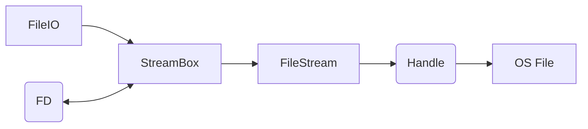
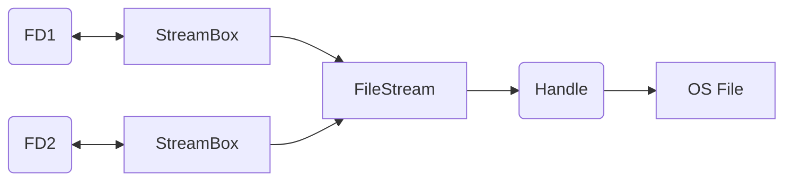
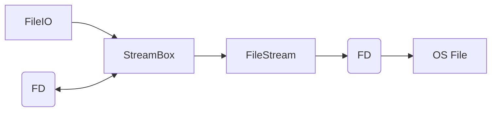
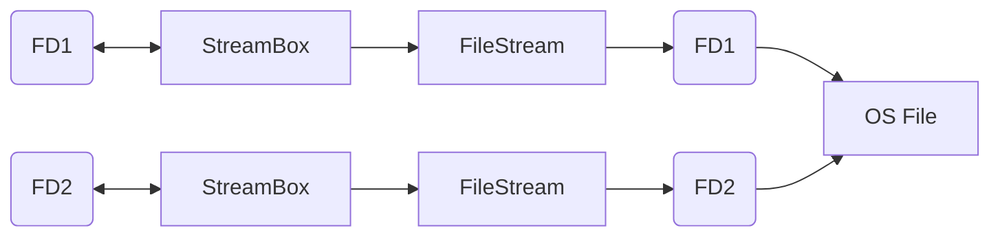
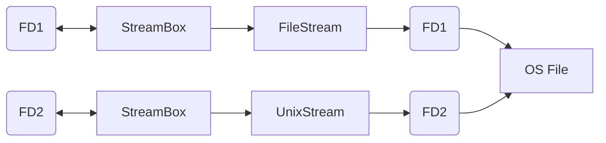
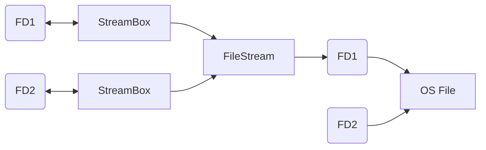
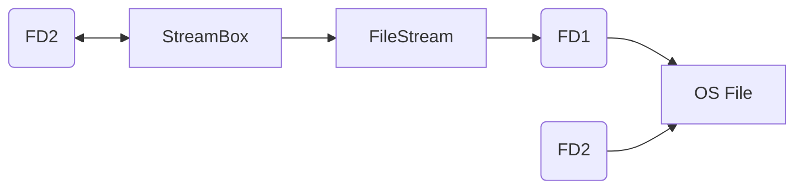
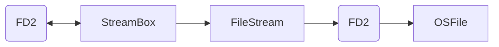
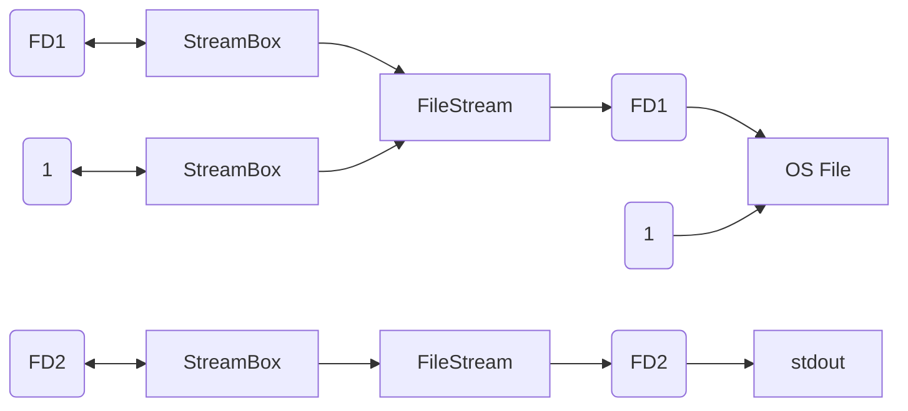

# File Descriptors in IronPython

## Windows

The conceptual picture of file descriptors (FDs) usage on Windows, for the most interesting case of `FileStream`:

Conceptually, the relationship between `FD` (a number) and `StreamBox` (a class) is bidirectional because `PythonFileManager` (global singleton) maintains the association between the two so it is cost-free to obtaining the one having the other. FD is not the same as the handle, which is created by the OS. FD is an emulated (fake) file descriptor, assigned by the `PythonFileManager`, for the purpose of supporting the Python API. The descriptors are allocated lazily, i.e. only if the user code makes an API call that accesses it. Once assigned, the descriptor does not change. The FD number is released once the FD is closed (or the associated `FileIO` is closed and had `closefd` set to true.)

It is possible to have the structure above without `FileIO`; for instance when an OS file is opened with one of the low-level functions in `os`, or when an existing FD is duplicated. It is also possible to associate an FD with several `FileIO`. In such cases it is the responsibility of the user code to take care that the FD is closed at the right time.

When FD is duplicated (using `dup` or `dup2`), the associated `StreamBox` is duplicated (there is always a 1-to-1 relationship between FD and `StreamBox`), but the underlying `FileStream` objects remain the same, and so are the underlying OS handles. The new FD may be used to create a `FileIO` (or several, just as the original FD). All read/seek/write operations on both descriptors go though the same `FileStream` object and the same OS handle.

The descriptors can be closed independently, and the underlying `FileStream` is closed when the last `StreamBox` using it is closed.

## Posix

On Unix-like systems (Linux, maxOS), `FileStream` uses the actual file descriptor as the handle. In the past. IronPython was ignoring this and still issuing its own fake file descriptors as it is in the case of Windows. Now, however, the genuine FD is extracted from the handle and used as FD at the `PythonFileManager` level, ensuring that clients of Python API obtain the genuine FD.

When descriptor FD is duplicated, the actual OS call is made to create the duplicate FD2. In order to use FD2 directly, a new `Stream` object has to be created around it.

### Optimal Mechanism

The optimal solution is to create another `FileStream` using the constructor that accepts an already opened file descriptor.

In this way, the file descriptor on the `PythonFileManager` level is the same as the file descriptor used by `FileStream`.

Unfortunately, on .NET, somehow, two `FileStream` instances using the same file descriptor will have the two independent read/write positions. This is not how duplicated file descriptors should work: both descriptors should point to the same file description structure and share the read/seek/write position. In practice, on .NET, writing through the second file object will overwrite data already written through the first file object. In regular Unix applications (incl. CPython), the subsequent writes append data, regardless which file object is used. The same principle should apply to reads.

Also unfortunately, on Mono, the `FileStream` constructor accepts only descriptors opened by another call to a `FileStream` constructor[[1]]. So descriptors obtained from direct OS calls, like `open`, `creat`, `dup`, `dup2` are being rejected.

### Mono Workaround

To use system-opened file descriptors on Mono `UnixStream` can be used instead of `FileStream`.

Since FileIO works with various types of the underlying `Stream`, using `UnixStream` should be OK.

Although `UnixStream` is available in .NET through package `Mono.Posix`, this solution still does not work around desynchronized read/write position, which `FileStream` using the original FD1 must somehow maintain independently.

### .NET Workaround

To ensure proper R/W behavior on .NET, operations on both file descriptions have to go though the same `FileStream` object. Since the duplicated file descriptor is basically just a number, pointing to the same file description as the original descriptor, on the OS level it doesn't matter which descriptor is used for operations. The only difference between those descriptors is flag `O_CLOEXEC`, which determines whether the descriptor stays open or not when child processed are executed.

This actually works OK, until `dup2` is used. When the FD1 descriptor (or the associated `FileIO`) is closed on the Python API level, the underlying OS descriptor is not released but still being used by `FileStream`. A small side effect is that it will not be reused until FD2 is closed, but other than that, the behaviour is as expected.

The problem arises when `dup2` is used with the target being FD1. This will forcibly close the descriptor used by `FileStream`, rendering the stream broken, despite having FD2 available. Perhaps closing `FileStream` using FD1 and opening a replacement around FD2 could be a solution, but this would have to be done atomically. If so, this would lead to a healthy structure.

## Practical Scenarios

None of the above solutions is fully satisfactory for .NET. Ideally, .NET would behave consistently with Posix, because even the most elaborate workarounds (like juggling various `FileStream` objects around the descriptors) only work within IronPython, and break down when a descriptor is passed to a 3rd party library that uses C extension and creates its own `FILE*` struct around it. The `FileStream` object in .NET knows nothing about it and will not adjust its R/W position.

In the meantime, let's look at some practical cases when `dup`/`dup2` are used and try to support just these. For what I have seen, `dup`/`dup2` are commonly used to redirect some of the standard descriptors. For example, to redirect standard output to a file:
1. Open a file for writing, it will get assigned descriptor FD1.
2. Copy descriptor 1 aside using `dup`. The copy will get assigned descriptor FD2.
3. Copy the open file descriptor FD1 onto descriptor 1 using `dup2`. This will forcibly close the existing descriptor 1, but not the output stream, which is sill accessible through descriptor FD2.
4. Code writing to "standard output", i.e. descriptor 1, will now write to the open file.
5. If needed, the application can still write to the original output stream by writing to descriptor FD2.
6. When done, close descriptor FD1.
7. Copy descriptor FD2 onto descriptor 1 using `dup2`. Since the is the last one pointing to the open file, the file will be closed as well.
8. Close descriptor FD2, the copy is not needed anymore.

The same scenario is commonly done for standard input and sometimes standard error.

The problem of .NET manifests itself when there are two descriptors open that refer to the same open file description and used concurrently. In the above scenario it is descriptor 1 and FD1. Assuming that the application is not using FD1 (typical use), the _Optimal Mechanism_ described above is sufficient.

If the application does insist on using both descriptors 1 and FD1, the first .NET workaround is needed. This will lead to the following structure:

The problem of closing FD1 and then overwriting it is not an issue, since only standard descriptors (0, 1, 2) are being overwritten with `dup2`. There is still a problem of overwriting data written by C extension code writing though descriptor 1. Perhaps replacing `FileStream` utilizing FD1 with `UnixStream` from Mono would make it more cooperative.

In the end, the implementation of genuine file descriptors in IronPython starts with the simple solution (the simple workarounds described above) and will be adjusted as needed to support the 3rd party Python packages.

## Special Case: Double Stream

In Python, a file can be opened with mode "ab+". The file is opened for appending to the end (created if not exists), and the `+` means that it is also opened for updating. i.e. reading and writing. The file pointer is initially set at the end of the file (ready to write to append) but can be moved around to read already existing data. However, each write will append data to the end and reset the read/write pointer at the end again. In IronPython this is simulated by using two file streams, one for reading and one fore writing. Both are maintained in a single `StreamBox` but will have different file descriptors. This is subject to change.

[1]: https://github.com/mono/mono/issues/12783
